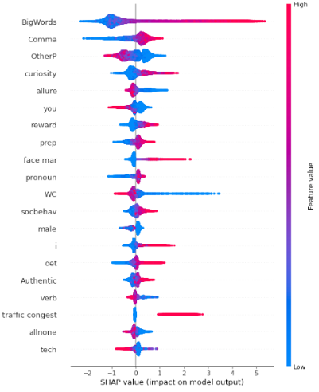
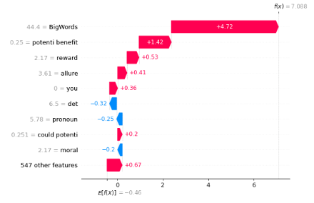

# Capstone

This repository contains the capstone project from my Data Science Masters program with Loyola University Maryland: 
# Differentiating LLM and Student Authorship in Long-Form Text

Classification models to distinguish LLM-Generated text from student-written essays. Feature importance analysis performed with SHAP explanations to provide interpretable insights on LLM detection. 

## Introduction
This project aims to address methods of authorship classification of long-form text and provide explainable insights of LLM detection. Text embeddings, semantic features, and psycholinguistic features were extracted from each essay to capture numerical values of the text. At the task of classification alone, this study found a Multi-Layer Perceptron fit to text embeddings performed best. This study also found an XGBoost fit to semantic and psycholinguistic features provide not only a comparable level of prediction, but also interpretable feature importance with SHAP.

## Dataset
A subset of 25,059 essays were used for this project from two joined datasets:
* [DAIGT-V4-Train-Dataset](https://www.kaggle.com/datasets/thedrcat/daigt-v4-train-dataset/data) by Darek Kleczek 
* [AI-Detection-Student-Writing](https://github.com/scrosseye/AI-Detection-Student-Writing) by Scott Crosseye 

Data was filtered down by manual review, duplicate removal, outlier removal, and null value removal. 

## Feature extraction pipeline:
* Longformer Embeddings - CLS Pooling
* Bigram and Trigram Term Frequency - Inverse Document Frequency (TF-IDF)
* Linguistic Inquiry and Word Count (LIWC-22)* 

*LIWC-22 extracted via desktop application

Significant variables from unpaired t-tests with Holm's correction were used for modeling. 

## Classification Models
Various classification models were explored:
* Support Vector Machine (SVM)
* Gaussian Naïve Bayes
* Multi-Layer Perceptron
* Decision Tree
* Random Forest
* K-Nearest Neighbors (KNN)
* XGBoost
* Multiple Logistic Regression

Models were fit to predictor groups in three series:
* Embeddings
* Embeddings, TF-IDF, and LIWC-22
* TF-IDF and LIWC-22

Model performance was compared by accuracy, precision, recall, F1-score, and ROC-AUC. The final model chosen was the best model from the third series, which performed approximately as well as the other two predictor groups.

### Model Performance

| Group | Accuracy  | Precision | Recall     | F1 Score |
|-------|-----------|-----------|------------|----------|
| 1     | 0.929336  | 0.943304  | 0.885417   | 0.912827 |
| 2     | 0.897030  | 0.906775  |  0.838221  | 0.870157 |
| 3     | 0.878292  | 0.881288  | 0.819351   | 0.847633 |

## SHAP Explanations

SHAP explanations were generated for the final model to interpret feature importance of the model as a whole, and decisions for individual predictions. An interesting takeaway in model predictions was the difference in lengthy words between students and LLMs. More specifically, the percentage of words longer than six letters was higher in LLMs. 

### XGBoost Model: TF-IDF and LIWC-22

Feature importance of model as explained SHAP explainer summary plot.

Feature importance of individual LLM detection with SHAP waterfall plot.

Example of implementation and more in-depth model comparison can be found in [demo.ipynb](Examples/demo.ipynb).

## Collaborators
A special thank you to Dr. Catherine Pollack and Dr. Catherine Schwartz from the Johns Hopkins University Applied Physics Laboratory for their mentorship and collaboration on this project!

## Contact
For any questions or comments, please connect with me on [LinkedIn](www.linkedin.com/in/nolan-clark-a64bb11b3)
